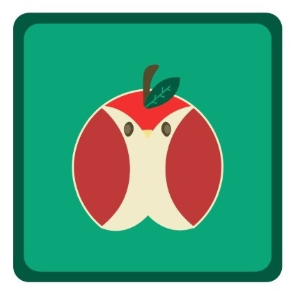

<h1 align="center">Znak</h1>

## 📝 O Projeto

  

Esse é um repositório que está sendo montado por um grupo de estudantes de Ciência da Computação do segundo período 2021.2 da Cesar School. Nosso grupo Znak, tem como principal objetivo, implementar um sistema eficiente para cantinas de ambientes escolares. Visto que, apresentam diversas dificuldades de organização no pagamento sobre os lanches oferecidos por tal cantina.

 

#### Membros de Ciência da Computação :
- [André Barcelar](mailto:albgm@cesar.school),  [Anthony Kevin](mailto:akds@cesar.school),  [João Pedro Duarte](mailto:jpds@cesar.school)
- [Julia Queiroz](mailto:jqa@cesar.school),  [Maria Luiza Laranjeira](mailto:mlbl@cesar.school),  [Victor Montarroyos](mailto:vpm@cesar.school)
#### Membros de Design :
- [Clara Santana](mailto:csgg@cesar.school),  [Luiza Brito](mailto:lcmb@cesar.school),  [Melina Fryer](mailto:mmf@cesar.school), [Vitor dos Santos](mailto:vsab@cesar.school)

---

## 📑Documentação Clara e Objetiva

Para conseguir contribuir com a codificação do nosso projeto é importante, antes de mais nada, que a pessoa tenha C instalado em sua máquina. Ela também deve considerar o download de algum tipo de ferramenta de versionamento para facilitar a compreensão do código. Além de fazer o download do código principal, eles também precisam ter arquivos txt específicos para download (todos os links serão fornecidos), dentro do mesmo diretório. Depois de todas essas etapas, eles devem ser capazes de executar o código sem problemas. No caso de quererem usar testes automáticos, eles teriam que baixar uma plataforma como o UNITY ou Expect para poder executar esses testes.

 

---

## :link: Links

[:link: Link para o protótipo de alta fidelidade.](https://www.figma.com/file/qKDf9xZ6fn1Wnpe4DxKB1G/ZNAK?node-id=124%3A206)

[:link: Link para a apresentação.](https://drive.google.com/file/d/1IDIZQ4TLz9fIZYKCPlDEAwFkqV6L77fF/view)

---
## :gear: :
### Ferramentas
- Visual Studio Code
- Miro
- Google Drive
- Google Docs
- Replit

### Linguagens
- C
